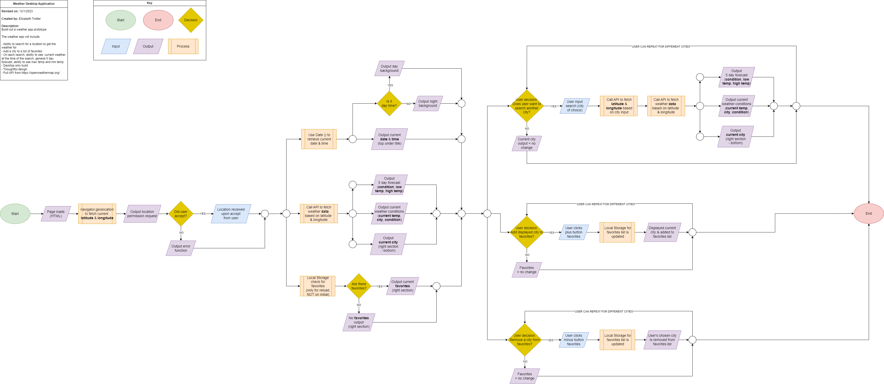

# Weather Application 

**Name:** Elizabeth Trotter

## Description

**Sprint 1:** 
- Design a desktop weather application (create using Figma)
- Flowchart the logic

**Sprint 2:** 
- Develop the application (build using vanilla JavaScript)

> [!NOTE]
> Click [here](#development-version) to scroll down to the most recent version history. 

## Prototype

Click [Prototype V 2](https://www.figma.com/proto/ZWrYFNi9Ei0d19MilmPCD7/Weather-App---Ver.-2?type=design&t=sql9SWjMqxd4uNh5-1&scaling=min-zoom&page-id=0%3A1&node-id=69-218&starting-point-node-id=69%3A218&show-proto-sidebar=1&mode=design) 
to visit the **final** Figma prototype design.

Click [Prototype V 1](https://www.figma.com/proto/jL80hvy3MCaoqOMIm4Ocbz/Weather-App---Ver.-1?type=design&t=zIhP92ZA2ElktHf1-1&scaling=min-zoom&page-id=0%3A1&node-id=69-218&starting-point-node-id=69%3A218&show-proto-sidebar=1&mode=design)
to visit the first prototype iteration.

## Flowchart

---

### Development Version

**Version 2.3 (V.2.3)**

***Features:***
1. Autofill dropdown visiblity increased for easier viewing
2. Scrolling added for improved favorite list navigation
3. Bug fix for recent history duplicates

**Version 2.2 (V.2.2)**

***Features:***
1. Autofill dropdown added for improved search functionality
2. Mouse hover effect added for search button interaction
3. Mouse hover effect added for favorites and recents button interactions
4. State abbreviations added for locations
5. Bug fix for favorite heart icon interactions
6. Bug fix for county search issues
7. Bug fix for autofill duplicates 

**Version 2.1 (V.2.1)**

***Features:***
1. Current weather forecast data
2. 5 day future forecast data
3. Search functionality
4. Ability to save and remove favorite locations
5. Icons to show weather conditions
6. Additional weather data units
7. Today's forecast
8. Recent search history
9. Favorite functionality with heart icon
10. Quick viewing of current weather data

### Protoype Versions

**Version 2 (V.2)**

***Features:***
1. Additional weather data units added
2. Today's forecast added
3. Recent search history added
4. Favorite functionality improved with heart icon addition
5. Current weather data moved up for easier visiblity
6. Logo added
7. All items available in V.1

**Version 1 (V.1)**

***Features:***
1. Current weather forecast data
2. 5 day future forecast data
3. Search functionality
4. Ability to save and remove favorite locations
5. Icons to show weather conditions